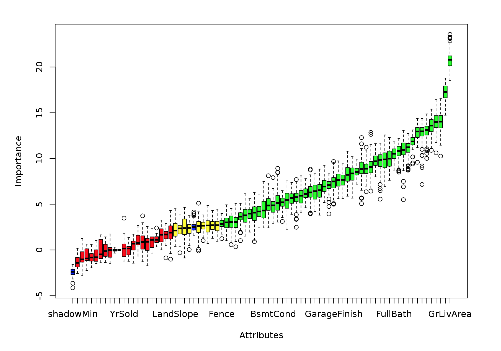
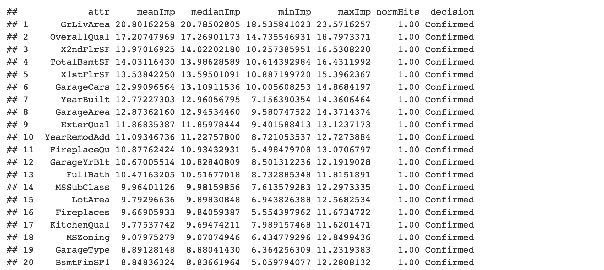

<br/>

<center> <h5> This is a **simplified version** of the program used for the Kaggle competition ["House Prices"](https://www.kaggle.com/c/house-prices-advanced-regression-techniques) </h5></center>
<center> 12/2016 </center>

<br/>


<br/>

# {.tabset}

## Data descriptions

Ask a home buyer to describe their dream house, and they probably won't begin with the height of the basement ceiling or the proximity to an east-west railroad. But this playground competition's dataset proves that much more influences price negotiations than the number of bedrooms or a white-picket fence.

With 79 explanatory variables describing (almost) every aspect of residential homes in Ames, Iowa, this competition challenges you to predict the final price of each home.

The potential for creative feature engineering provides a rich opportunity for fun and learning. This dataset lends itself to advanced regression techniques like random forests and gradient boosting with the popular XGBoost library. We encourage Kagglers to create benchmark code and tutorials on Kernels for community learning. Top kernels will be awarded swag prizes at the competition close. 

Acknowledgments

The Ames Housing dataset was compiled by Dean De Cock for use in data science education. It's an incredible alternative for data scientists looking for a modernized and expanded version of the often cited Boston Housing dataset. 

<br/>
<hr/>
<br/>

<center> Find the data and the code on [Kaggle](https://www.kaggle.com/c/house-prices-advanced-regression-techniques/) or on [Github](https://github.com/ludovicbenistant/Kaggle) </center>

<br/>
<hr/>
<br/>

## File descriptions

train.csv - the training set  
test.csv - the test set  
data_description.txt - full description of each column, originally prepared by Dean De Cock but lightly edited to match the column names used here  
sample_submission.csv - a benchmark submission from a linear regression on year and month of sale, lot square footage, and number of bedrooms  

<br/>
<hr/>
<br/>

<center> Find the data and the code on [Kaggle](https://www.kaggle.com/c/house-prices-advanced-regression-techniques/) or on [Github](https://github.com/ludovicbenistant/Kaggle) </center>

<br/>
<hr/>
<br/>

## Variables

SalePrice - the property's sale price in dollars. This is the target variable that you're trying to predict.  
MSSubClass: The building class  
MSZoning: The general zoning classification  
LotFrontage: Linear feet of street connected to property  
LotArea: Lot size in square feet  
Street: Type of road access  
Alley: Type of alley access  
LotShape: General shape of property  
LandContour: Flatness of the property
Utilities: Type of utilities available  
LotConfig: Lot configuration  
LandSlope: Slope of property  
Neighborhood: Physical locations within Ames city limits  
Condition1: Proximity to main road or railroad  
Condition2: Proximity to main road or railroad (if a second is present)  
BldgType: Type of dwelling  
HouseStyle: Style of dwelling  
OverallQual: Overall material and finish quality  
OverallCond: Overall condition rating  
YearBuilt: Original construction date  
YearRemodAdd: Remodel date  
RoofStyle: Type of roof  
RoofMatl: Roof material  
Exterior1st: Exterior covering on house  
Exterior2nd: Exterior covering on house (if more than one material)  
MasVnrType: Masonry veneer type  
MasVnrArea: Masonry veneer area in square feet  
ExterQual: Exterior material quality  
ExterCond: Present condition of the material on the exterior  
Foundation: Type of foundation  
BsmtQual: Height of the basement  
BsmtCond: General condition of the basement  
BsmtExposure: Walkout or garden level basement walls  
BsmtFinType1: Quality of basement finished area  
BsmtFinSF1: Type 1 finished square feet  
BsmtFinType2: Quality of second finishedarea (if present)  
BsmtFinSF2: Type 2 finished square feet  
BsmtUnfSF: Unfinished square feet of basement area  
TotalBsmtSF: Total square feet of basement area  
Heating: Type of heating  
HeatingQC: Heating quality and condition  
CentralAir: Central air conditioning  
Electrical: Electrical system  
1stFlrSF: First Floor square feet  
2ndFlrSF: Second floor square feet   
LowQualFinSF: Low quality finished square feet (all floors)  
GrLivArea: Above grade (ground) living area square feet  
BsmtFullBath: Basement full bathrooms  
BsmtHalfBath: Basement half bathrooms  
FullBath: Full bathrooms above grade  
HalfBath: Half baths above grade  
Bedroom: Number of bedrooms above basement level  
Kitchen: Number of kitchens  
KitchenQual: Kitchen quality  
TotRmsAbvGrd: Total rooms above grade (does not include bathrooms)  
Functional: Home functionality rating  
Fireplaces: Number of fireplaces  
FireplaceQu: Fireplace quality  
GarageType: Garage location  
GarageYrBlt: Year garage was built  
GarageFinish: Interior finish of the garage  
GarageCars: Size of garage in car capacity  
GarageArea: Size of garage in square feet  
GarageQual: Garage quality  
GarageCond: Garage condition  
PavedDrive: Paved driveway  
WoodDeckSF: Wood deck area in square feet  
OpenPorchSF: Open porch area in square feet  
EnclosedPorch: Enclosed porch area in square feet  
3SsnPorch: Three season porch area in square feet  
ScreenPorch: Screen porch area in square feet  
PoolArea: Pool area in square feet  
PoolQC: Pool quality  
Fence: Fence quality  
MiscFeature: Miscellaneous feature not covered in other categories  
MiscVal: $Value of miscellaneous feature  
MoSold: Month Sold  
YrSold: Year Sold  
SaleType: Type of sale  
SaleCondition: Condition of sale  

<br/>
<hr/>
<br/>

<center> Find the data and the code on [Kaggle](https://www.kaggle.com/c/house-prices-advanced-regression-techniques/) or on [Github](https://github.com/ludovicbenistant/Kaggle) </center>

<br/>
<hr/>
<br/>

## About Kaggle

In 2010, Kaggle was founded as a platform for predictive modelling and analytics competitions on which companies and researchers post their data and statisticians and data miners from all over the world compete to produce the best models.  
  
This crowdsourcing approach relies on the fact that there are countless strategies that can be applied to any predictive modelling task and it is impossible to know at the outset which technique or analyst will be most effective. Kaggle also hosts recruiting competitions in which data scientists compete for a chance to interview at leading data science companies like Facebook, Winton Capital, and Walmart.

<br/>
<hr/>
<br/>

<center> Find the data and the code on [Kaggle](https://www.kaggle.com/c/house-prices-advanced-regression-techniques/) or on [Github](https://github.com/ludovicbenistant/Kaggle) </center>

<br/>
<hr/>
<br/>

# Libraries

<br/>

```{r, warning=F, message=F, echo=TRUE}
# For data manipulation and tidying
library(MASS)
library(tidyr)
library(plyr)
library(dplyr)
library(broom)
library(data.table)
library(testthat)
library(gridExtra)

# For data visualizations
library(ggplot2)
library(plotly)
library(DT)
library(corrplot)
library(GGally)
library(Boruta)
library(pROC)
library(VIM)
library(mice)

# For modeling and predictions
library(mlbench)
library(caret)
library(glmnet)
library(ranger)
library(clValid)
library(e1071)
library(xgboost)

```

<br/>
<hr/>
<br/>

# Data Exploration {.tabset}

<br/>

## Data

```{r, message=F, warning=F}
train <- read.csv("train.csv", header = TRUE, sep = ",", stringsAsFactors = FALSE)
data.test <- read.csv("test.csv", header = TRUE, sep = ",", stringsAsFactors = FALSE)
datatable(head(train, n=20),options = list(scrollX = TRUE))
```

<br/> 
<hr/>
<br/>

## Summary

```{r}
summary(train)
```

<br/> 
<hr/>
<br/>

## Visualisation

Thanks to [laurae2](https://www.kaggle.com/c/house-prices-advanced-regression-techniques/) for this code for plotting all data using tabplots. The objective is to find out some of the good features visually. As Laurae2 say: you can think of it as the vertical as the "sort by SalePrice":

```{r, fig.width = 11, fig.height = 5.5, message = FALSE, warning = FALSE}
invisible(library(tabplot))
invisible(library(data.table))

columns <- c("numeric",
             rep("character", 2),
             rep("numeric", 2),
             rep("character", 12),
             rep("numeric", 4),
             rep("character", 5),
             "numeric",
             rep("character", 7),
             "numeric",
             "character",
             rep("numeric", 3),
             rep("character", 4),
             rep("numeric", 10),
             "character",
             "numeric",
             "character",
             "numeric",
             rep("character", 2),
             "numeric",
             "character",
             rep("numeric", 2),
             rep("character", 3),
             rep("numeric", 6),
             rep("character", 3),
             rep("numeric", 3),
             rep("character", 2),
             rep("numeric"))

train$SalePrice <- log(train$SalePrice) # To respect lrmse
train_visu <- as.data.frame(train)

for (i in 1:80) {
  if (typeof(train_visu[, i]) == "character") {
    train_visu[is.na(train_visu[, i]), i] <- ""
    train_visu[, i] <- as.factor(train_visu[, i])
  }
}

for (i in 1:16) {
  plot(tableplot(train_visu, select = c(((i - 1) * 5 + 1):(i * 5), 81), sortCol = 6, nBins = 73, plot = FALSE), fontsize = 12, title = paste("log(SalePrice) vs ", paste(colnames(train_visu)[((i - 1) * 5 + 1):(i * 5)], collapse = "+"), sep = ""), showTitle = TRUE, fontsize.title = 12)
}

```

<br/> 
<hr/>
<br/>

## Boruta

Thanks to [Jim Thompson (JMT5802)](https://www.kaggle.com/jimthompson/house-prices-advanced-regression-techniques/boruta-feature-importance-analysis/code) for this **Boruta Feature Importance Analysis**. This report determines what features may be relevant to predicting house sale price. This analysis is based on the [Boruta](https://cran.r-project.org/web/packages/Boruta/index.html) package. The code can be found [here](https://www.kaggle.com/jimthompson/house-prices-advanced-regression-techniques/boruta-feature-importance-analysis/code).

```{r, eval=FALSE}
ID.VAR <- "Id"
TARGET.VAR <- "SalePrice"

# Data Preparation for Bourta Analysis
# retrive data for analysis
sample.df <- read.csv(file.path(ROOT.DIR,"input/train.csv"),stringsAsFactors = FALSE)
# extract only candidate feture names
candidate.features <- setdiff(names(sample.df),c(ID.VAR,TARGET.VAR))
data.type <- sapply(candidate.features,function(x){class(sample.df[[x]])})
# deterimine data types
explanatory.attributes <- setdiff(names(sample.df),c(ID.VAR,TARGET.VAR))
data.classes <- sapply(explanatory.attributes,function(x){class(sample.df[[x]])})
# categorize data types in the data set?
unique.classes <- unique(data.classes)
attr.data.types <- lapply(unique.classes,function(x){names(data.classes[data.classes==x])})
names(attr.data.types) <- unique.classes

#Prepare data set for Boruta analysis.  For this analysis, missing values are
#handled as follows:
#* missing numeric data is set to -1
#* missing character data is set to __*MISSING*__

# pull out the response variable
response <- sample.df$SalePrice

# remove identifier and response variables
sample.df <- sample.df[candidate.features]

# for numeric set missing values to -1 for purposes of the random forest run
for (x in attr.data.types$integer){
  sample.df[[x]][is.na(sample.df[[x]])] <- -1
}

for (x in attr.data.types$character){
  sample.df[[x]][is.na(sample.df[[x]])] <- "*MISSING*"
}

# Run Boruta Analysis
set.seed(13)
bor.results <- Boruta(sample.df,response,
                   maxRuns=101,
                   doTrace=0)
cat("\nSummary of Boruta run:\n")
print(bor.results)

cat("\n\nRelevant Attributes:\n")
getSelectedAttributes(bor.results)
plot(bor.results)

#Detailed results for each candidate explanatory attributes.

cat("\n\nAttribute Importance Details:\n")
options(width=125)
arrange(cbind(attr=rownames(attStats(bor.results)), attStats(bor.results)),desc(medianImp))
```





<br/> 
<hr/>
<br/>


## Missing values

```{r, message=F, warning=F, fig.width=10}
aggr(train, prop = F, numbers = T)
apply(is.na(train),2,sum)
```

<br/> 
<hr/>
<br/>

# Data Preparation {.tabset}

<br/>

The goal here is to **select the most relevant features**, **reshape them**, **handle missing values and outliers** and get data ready to be processed by different machine learning models.

<br/>

## Feature selection

```{r}
# 1. Incorporate results of Boruta analysis
Boruta_analysis <- c("MSSubClass","MSZoning","LotArea","LotShape","LandContour","Neighborhood",
                    "BldgType","HouseStyle","OverallQual","OverallCond","YearBuilt",
                    "YearRemodAdd","Exterior1st","Exterior2nd","MasVnrArea","ExterQual",
                    "Foundation","BsmtQual","BsmtCond","BsmtFinType1","BsmtFinSF1",
                    "BsmtFinType2","BsmtUnfSF","TotalBsmtSF","HeatingQC","CentralAir",
                    "X1stFlrSF","X2ndFlrSF","GrLivArea","BsmtFullBath","FullBath","HalfBath",
                    "BedroomAbvGr","KitchenAbvGr","KitchenQual","TotRmsAbvGrd","Functional",
                    "Fireplaces","FireplaceQu","GarageType","GarageYrBlt","GarageFinish",
                    "GarageCars","GarageArea","GarageQual","GarageCond","PavedDrive","WoodDeckSF",
                    "OpenPorchSF","Fence", "SalePrice")

train_selected_boruta <- train[Boruta_analysis]

# Identify near zero variance predictors: remove_cols
remove_cols <- nearZeroVar(train_selected_boruta, names = TRUE, 
                           freqCut = 2, uniqueCut = 20)

# Remove predictors with low variance 
all_cols <- names(train_selected_boruta)
train_selected <- train_selected_boruta[ , setdiff(all_cols, remove_cols)]
```

<br/>
<hr/>
<br/>

## Types

```{r}
# transform all the charaters variable into factor
train_selected[sapply(train_selected, is.character)] <- lapply(train_selected[sapply(train_selected, is.character)], as.factor)
```

<br/>
<hr/>
<br/>

## Outliers

```{r, fig.width=10}
train_selected_outliers <- train_selected
# remove outliers
train_selected <- subset(train_selected,!(train_selected$SalePrice > quantile(train_selected$SalePrice, probs=c(.01, .99))[2] | train_selected$SalePrice < quantile(train_selected$SalePrice, probs=c(.01, .9))[1]) ) 

par(mfrow=c(1,2))
boxplot(train_selected_outliers$SalePrice, main="Before")
boxplot(train_selected$SalePrice, main="After")
```

<br/>
<hr/>
<br/>

## Missing values

**Heuristics or rules of thumb**

- Numeric variables: PMM (Predictive Mean Matching)  
- For Binary Variables( with 2 levels): logreg(Logistic Regression)  
- For Factor Variables (>= 2 levels): polyreg(Bayesian polytomous regression)    

As we **keep this model simple we just use ppm**.

```{r}
# missingvaluenumeric <- MasVnrArea, GarageYrBlt
# missingvaluefactor <- c('BsmtQual', 'BsmtFinType1', 'FireplaceQu', 'GarageFinish') 
## FireplaceQu miss almost 50% of value!! 
tempData <- mice(train_selected,m=5,maxit=50,meth='pmm',seed=500)
train_selected_reform <- complete(tempData,1)
apply(is.na(train_selected_reform),2,sum)

```

<br/> 
<hr/>
<br/>

# Modeling {.tabset}

<br/> 

We now build and evaluate two **simple regression models** that will need to be futher tuned. 

## Generalized Boosted Regression Models (Gbm)


```{r, warning=F, message=F}
### 1
# Train on cross-validation
train_control<- trainControl(method="cv", number=8, repeats=5)

# Build the Generalized Boosted Regression Models
gbm <- train(SalePrice~., data=train_selected_reform, trControl=train_control, method="gbm")

# make prediction on the train data
prediction <- predict(gbm, train_selected_reform)
binded <- cbind(train_selected_reform, prediction)
```

Calculate the **rmse**

```{r}
res <- binded$SalePrice - prediction
rmse <- sqrt(mean(res ^ 2))
print(rmse)
```

Example: this code isn't ran (it's just an ideas on how this algorithm could be futher tuned)

```{r, eval=FALSE}
library(hydroGOF)
library(Metrics)

caretGrid <- expand.grid(interaction.depth=c(1, 3, 5), n.trees = (0:50)*50,
                   shrinkage=c(0.01, 0.001),
                   n.minobsinnode=10)
metric <- "RMSE"

set.seed(99)
gbm.caret <- train(SalePrice ~ ., data=train_selected_reform, method="gbm",
              trControl=train_control, verbose=FALSE, 
              tuneGrid=caretGrid, metric=metric, bag.fraction=0.75)

print(gbm.caret)

```


<center> Find the data and the code on [Kaggle](https://www.kaggle.com/c/house-prices-advanced-regression-techniques/) or on [Github](https://github.com/ludovicbenistant/Kaggle) </center>

<br/> 
<hr/>
<br/>


## Extreme Gradient Boosting (Xgboost)


```{r, warning=F, message=F}
xgbTree <- train(SalePrice~., data=train_selected_reform, trControl=train_control, method="xgbTree")
# make prediction on the train data
prediction <- predict(xgbTree, train_selected_reform)
binded <- cbind(train_selected_reform, prediction)
```

Calculate the **rmse**

```{r}
res <- binded$SalePrice - prediction
rmse <- sqrt(mean(res ^ 2))
print(rmse)
```

*learn more about how to tune a Xgboost here https://github.com/topepo/caret/blob/master/RegressionTests/Code/xgbTree.R

<br/> 
<hr/>
<br/>

<center> Find the data and the code on [Kaggle](https://www.kaggle.com/c/house-prices-advanced-regression-techniques/) or on [Github](https://github.com/ludovicbenistant/Kaggle) </center>

<br/> 
<hr/>
<br/>


